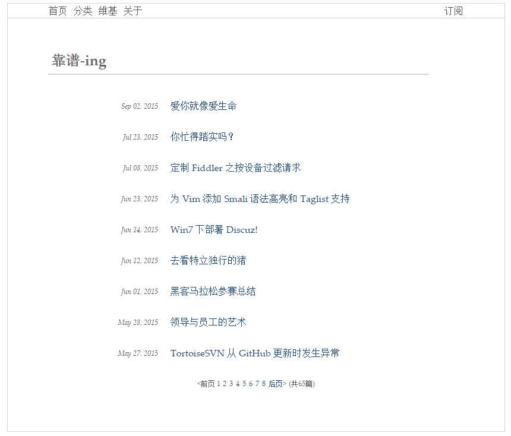

# xiaolitongxue666 Blog

基于 Jekyll 的个人技术博客，采用 jekyll-theme-solid 主题定制版，专注于技术分享和学习记录。

## 特性

- 轻量级 Jekyll 静态站点，构建快速
- 响应式布局，适配移动端和桌面端
- 明暗主题切换（`theme-toggle.js`）
- 文章页浮动导航按钮（`floating-buttons.js`）
- SEO 优化（jekyll-seo-tag）
- Obsidian 笔记自动同步（GitHub Actions，见 [obsidian_repo](https://github.com/xiaolitongxue666/obsidian_repo)）

## 技术栈

- **静态站点生成器**: Jekyll 3.9.5（github-pages gem 231）
- **主题**: jekyll-theme-solid（定制版，布局/CSS 内嵌于仓库）
- **样式**: CSS3 + 响应式设计
- **部署**: GitHub Pages（`master` 分支）
- **内容管理**: Obsidian + GitHub Actions 自动同步

## 项目结构

```
├── .github/workflows/   # jekyll-build.yml, e2e-publish.yml
├── .github/e2e/         # E2E 测试夹具
├── .github/scripts/e2e/ # E2E 断言脚本
├── Gemfile              # Ruby 依赖（github-pages）
├── _config.yml          # Jekyll 站点配置
├── _includes/           # header / footer / pagination
├── _layouts/            # default（文章/首页）、page（静态页/Wiki）
├── _posts/              # 博客文章（35 篇）
├── _wiki/               # Wiki 集合
├── assets/
│   ├── css/             # default.css / small.css / syntax.css
│   ├── js/              # theme-toggle.js / floating-buttons.js
│   └── images/
│       ├── avatar.jpg   # 头像（同时用作 favicon）
│       ├── common/      # 截图等通用图片
│       └── posts/       # 文章配图（按年份/文章目录组织）
├── docs/ARCHITECTURE.md # 架构与 CI 链路说明
├── index.html           # 首页（分页列表）
└── pages/               # about / links / categories / wiki / 404
```

详细架构说明见 [docs/ARCHITECTURE.md](docs/ARCHITECTURE.md)。问题排查见 [docs/TROUBLESHOOTING.md](docs/TROUBLESHOOTING.md)。Agent 指南见 [AGENTS.md](AGENTS.md)。

## 本地开发

### 环境要求

- Ruby >= 2.7
- Bundler

### 安装与启动

```bash
git clone https://github.com/xiaolitongxue666/xiaolitongxue666.github.io.git
cd xiaolitongxue666.github.io
bundle install
bundle exec jekyll serve --port 4001
```

访问 `http://localhost:4001`。

### 构建验证

```bash
bundle exec jekyll build --trace
```

## 自动同步机制

博客内容主要来自 [obsidian_repo](https://github.com/xiaolitongxue666/obsidian_repo)：

1. Obsidian 笔记中添加 `#xiaolitongxue666_blog` 标签
2. 推送到 obsidian_repo 的 `master` 分支
3. GitHub Actions 转换格式并同步到本仓库 `_posts/` 和 `assets/images/posts/`
4. GitHub Pages 自动构建部署

**PR 行为**：Pull Request 仅做预览与 Jekyll 构建验证，不会 push 到博客仓库。

## 写作指南

### 文件名规则

```
YYYY-MM-DD-{sanitizedTitle}.md
```

- **日期**：front matter `date` > 正文中的 `YYYY-MM-DD` > 当天（Obsidian 同步脚本规则）
- **slug**：Obsidian 笔记文件名经 sanitize 后转小写 kebab-case
- **permalink**：`/:year/:month/:day/:title/`（由文件名 slug 决定，**勿重命名已发布文章**）

### Front Matter 模板

```yaml
---
layout: default
title: "文章标题"
date: YYYY-MM-DD 12:00:00 +0800
categories: [分类1]
tags: [标签1, 标签2]
---
```

### 图片规则

```
assets/images/posts/{YYYY}/{articleDate}-{sanitizedTitle}/{articleDate}-{sanitizedTitle}_{NNN}.{ext}
```

引用示例：

```markdown

```

## 部署

推送到 `master` 分支后，GitHub Pages 自动构建部署。本仓库 CI（`.github/workflows/jekyll-build.yml`）在 push/PR 时执行构建校验与直写 E2E（`run-publish-e2e.js`）。

## E2E 测试

- **日常 CI**：`jekyll-build.yml` 构建成功后运行 `node .github/scripts/e2e/run-publish-e2e.js`
- **手动线上验证**：`gh workflow run e2e-publish.yml -f live_verify=true`
- 详细说明见 [docs/ARCHITECTURE.md](docs/ARCHITECTURE.md#e2e-测试)

## 截图

### 首页


### 文章页面


## 许可证

MIT License

## 联系方式

- GitHub: [@xiaolitongxue666](https://github.com/xiaolitongxue666)
