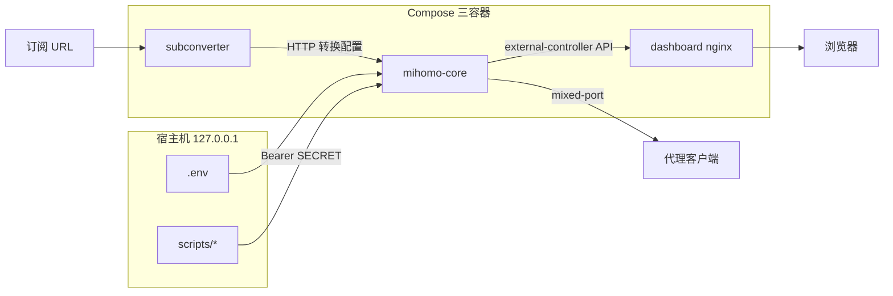
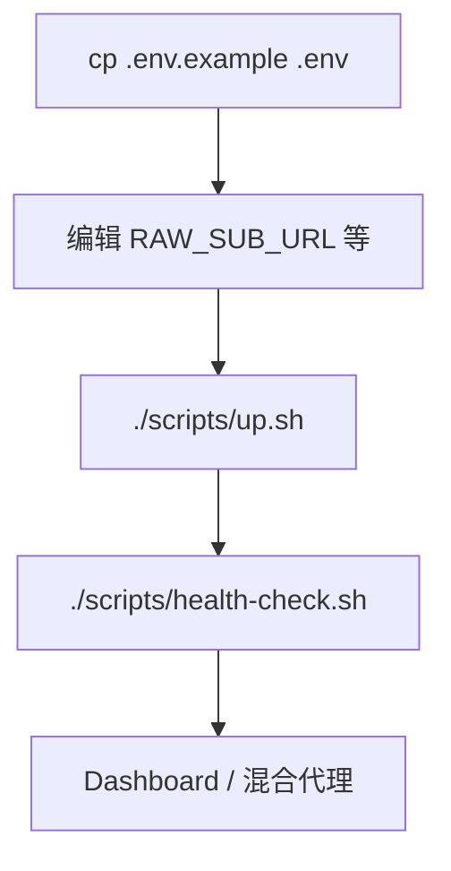
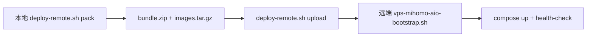
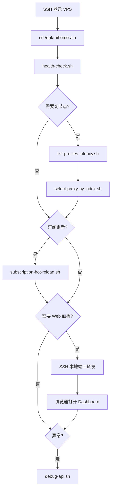
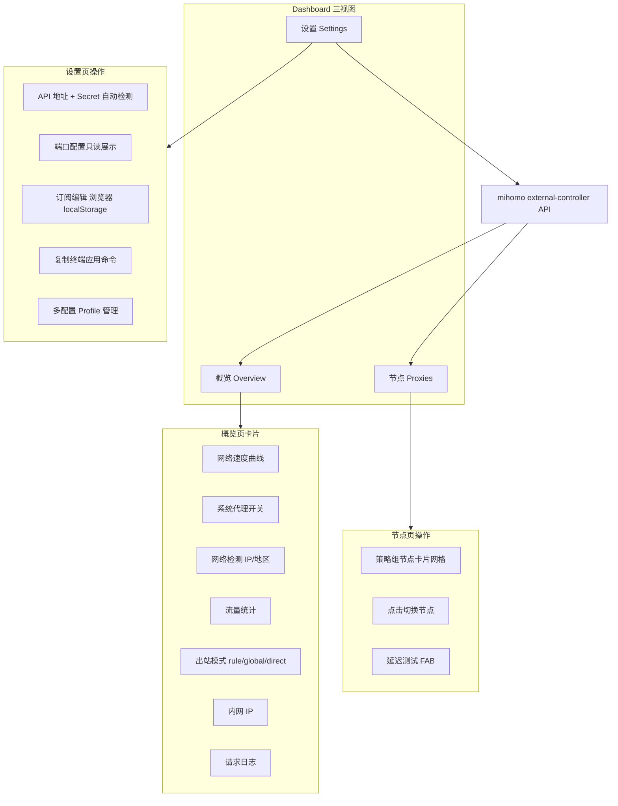

# mihomo-aio：容器化代理栈介绍、部署与运维

- 项目仓库：https://github.com/xiaolitongxue666/mihomo-aio
- 上游内核：[MetaCubeX/mihomo](https://github.com/MetaCubeX/mihomo)

## 为什么需要 mihomo-aio

如果你只是想在本地或 VPS 上跑 [mihomo](https://github.com/MetaCubeX/mihomo)（Clash Meta 内核），通常会碰到几类重复劳动：

- 订阅要先经 **subconverter** 转成 Clash/Meta 配置，再手工对齐端口、`secret`、`external-controller` 等控制面字段
- 需要一个能看节点、测延迟、切换出站模式的 **Web 面板**，又不想额外部署一整套重量级 GUI
- 本机有外网时可以 `docker pull`，但 **无外网 VPS** 往往无法在线拉镜像，需要离线打包与一键 bootstrap
- 长期运维希望有脚本化入口：健康检查、热重载订阅、按序号切节点，而不是每次手写 `curl`

**mihomo-aio** 把上述能力收成一套三容器栈：`subconverter + mihomo-core + dashboard`，用单一 `.env` 管理端口与订阅，并提供 `scripts/` 运维脚本与 FlClash 风格的轻量 Dashboard。Compose 默认把所有服务端口绑定在 **127.0.0.1**，降低误暴露到公网的风险。

## 架构概览



**数据流简述：**

1. 启动时 `entrypoint.sh` 向 subconverter 请求转换后的 `config.yaml`
2. 脚本强制写回 `allow-lan`、`mixed-port`、`external-controller`、`secret`，避免订阅自带配置覆盖控制面
3. `./data/config` 与 `./data/mihomo` 分别挂载为配置目录与运行时目录
4. Dashboard 通过 nginx 提供静态页面，读写 mihomo 的 external-controller REST API

## 核心组件

| 组件 | 职责 |
|---|---|
| subconverter | 将订阅 URL 转为 Clash/Meta 配置 |
| mihomo-core | 代理核心；对外提供 mixed 端口与 API |
| dashboard | 静态 Web 面板，经 API 控制节点与出站模式 |

## 在线部署



```bash
cp .env.example .env
# 编辑 .env（至少填写 RAW_SUB_URL）
./scripts/up.sh
./scripts/health-check.sh
```

`.env.example` 中的默认本机访问地址（端口可按需修改）：

| 用途 | 地址 |
|---|---|
| Dashboard | `http://127.0.0.1:19091` |
| 混合代理 | `127.0.0.1:17890` |
| external-controller API | `http://127.0.0.1:19090` |
| subconverter | `127.0.0.1:25501` |

本地 `./scripts/up.sh` 与 `./scripts/down.sh` 会读取 `VPS_DEPLOY_CONTAINER_ENGINE`：

```bash
# Docker（默认）
VPS_DEPLOY_CONTAINER_ENGINE=docker

# Podman
VPS_DEPLOY_CONTAINER_ENGINE=podman
```

Podman 模式要求已安装 `podman` 与 `podman-compose`，且本地已有镜像（或由离线 bootstrap 导入后打 `localhost/*:latest` 标签）。

## `.env` 配置要点

至少关注以下变量（示例值来自 `.env.example`，请勿直接复制到生产环境）：

```bash
RAW_SUB_URL="https://example.com/subscription"
SECRET="change-me"

ALL_PROXY_PORT=17890
EXTERNAL_CONTROLLER_PORT=19090
CONTROL_PANEL_PORT=19091
SUBCONVERTER_HOST_PORT=25501
MIXED_PORT=7890
```

说明：

- `RAW_SUB_URL` 为必填项；文中仅用占位 URL
- `SECRET` 必须改掉默认值 `change-me`，Dashboard 与脚本均通过 Bearer 认证访问 API
- 四类宿主机端口在 compose 中映射到 `127.0.0.1`；部署前可在 VPS 上自检是否冲突：

```bash
ss -tulpen | grep -E ':(17890|19090|19091|25501)\b' || true
```

若无输出，通常表示这些端口当前无监听；若有占用，请在本地改 `.env` 后重新打包/启动。

## 离线 VPS 部署

适用于 VPS **无外网**或**无法拉取 Docker Hub** 的场景。



**本地：**

```bash
cp .env.example .env
# 配置 RAW_SUB_URL、VPS_DEPLOY_*、端口、容器引擎等
./deploy-remote.sh pack
./deploy-remote.sh upload
```

产物包括 `dist/mihomo-aio-bundle.zip` 与 `dist/mihomo-aio-images.tar.gz`（内含三容器离线镜像层）。

**远端：**

```bash
sudo bash vps-mihomo-aio-bootstrap.sh .
```

bootstrap 会解压 bundle、导入镜像、按需安装 Docker/Podman，并 `compose up` 后触发健康检查。远端部署目录示例为 `/opt/mihomo-aio`（与 `VPS_DEPLOY_DEPLOY_DIR` 占位一致）。

离线部署相关的 SSH 变量（仅列名称，示例值请自行替换）：

- `VPS_DEPLOY_SSH_HOST`
- `VPS_DEPLOY_SSH_USER`
- `VPS_DEPLOY_REMOTE_DIR`（如 `/home/your-user/mihomo-aio-upload`）
- `VPS_DEPLOY_DEPLOY_DIR`（如 `/opt/mihomo-aio`）

## VPS 脚本工具

部署完成后，在 VPS 上日常运维主要依赖 `scripts/`。这些脚本统一通过 `common-env.sh` 加载环境：先读 `.env.example`，再用 `.env` 覆盖；并导出 `api_base_url()`、`dashboard_url()`、`auth_header()`，按 `VPS_DEPLOY_CONTAINER_ENGINE` 选择 `docker compose` 或 `podman compose`。

### 脚本一览

| 分类 | 脚本 | 用途 | VPS 典型场景 |
|---|---|---|---|
| 生命周期 | `up.sh` / `down.sh` | 启动/关闭三容器栈 | 维护窗口重启 |
| 生命周期 | `compose-up.sh` / `compose-down.sh` | 底层 compose 封装 | 被 up/down 调用 |
| 验收 | `health-check.sh` | 四步检查 | bootstrap 后、变更后验收 |
| 验收 | `smoke-test.sh` | up → 等待 → health-check → 抽样测延迟 | 首次部署或升级后 |
| 节点运维 | `list-proxies-latency.sh [limit]` | 列出策略组节点及延迟(ms) | SSH 终端快速选节点 |
| 节点运维 | `select-proxy-by-index.sh [limit]` | 交互式按序号切换节点 | 无浏览器时的主力工具 |
| 订阅 | `subscription-hot-reload.sh` | 拉订阅并 PUT `/configs` 热重载 | 订阅更新不重启容器 |
| 面板配置 | `sync-dashboard-config.sh` | 从 `.env` 生成 `runtime-config.json` | 热重载后同步面板 |
| 调试 | `debug-api.sh` | 容器状态、API、日志、配置字段 | 故障排查首选 |
| 调试 | `shell.sh` | 进入 `mihomo-aio-core` 容器 | 深入排查 |

### health-check.sh 四步

1. 轮询 `GET /version`（最多约 30 秒），确认 external-controller 就绪
2. `GET /proxies` 验证 API 可用
3. `curl` Dashboard 首页（`127.0.0.1:${CONTROL_PANEL_PORT}`）
4. 经混合代理 `curl -x http://127.0.0.1:${ALL_PROXY_PORT}` 探测外连；失败时提示节点或订阅问题，不视为脚本硬失败

所有 `curl` 均使用 `--noproxy '*'`，避免宿主机 HTTP 代理干扰本机回环检测。

### VPS 日常运维示例

```bash
cd /opt/mihomo-aio

# 部署/变更后验收
./scripts/health-check.sh

# 查看前 20 个节点延迟
./scripts/list-proxies-latency.sh 20

# 交互式切换节点（适合纯 SSH 环境）
./scripts/select-proxy-by-index.sh 20

# 订阅变更后热重载（无需 down/up）
./scripts/subscription-hot-reload.sh

# 出问题时
./scripts/debug-api.sh
```

### VPS 运维工作流



VPS 上 Dashboard 默认只监听 `127.0.0.1`，可从本机经 SSH 隧道访问（占位主机名，请替换为你的 VPS）：

```bash
ssh -L 19091:127.0.0.1:19091 -L 19090:127.0.0.1:19090 your-user@your-vps-host
# 本机浏览器访问 http://127.0.0.1:19091
```

> **注意：** `subscription-hot-reload.sh`、`debug-api.sh`、`shell.sh` 内部使用 `docker` 命令；纯 Podman 环境需改用等价的 `podman` 操作。

## Dashboard Web 面板

Dashboard 是单页静态应用（`dashboard/index.html`），FlClash 风格暗色布局。由 nginx 容器挂载 `./dashboard` 提供，通过 mihomo **external-controller REST API** 读写状态。启动栈时 `sync-dashboard-config.sh` 会从 `.env` 生成 `dashboard/runtime-config.json`（该文件不入库，可能含订阅摘要，请勿公开）。

### 三视图结构



### 概览（Overview）

| 区域 | 功能 |
|---|---|
| 网络速度 | 实时上下行速率与 canvas 折线图 |
| 系统代理 | 与右下角 FAB「启动代理」联动 |
| 网络检测 | 显示出口 IP 与地区 |
| 流量统计 | 上传/下载累计与环形图 |
| 出站模式 | 规则 / 全局 / 直连，经 API 切换 |
| 内网 IP | 本机地址展示 |
| 请求日志 | API 调用日志，可清空 |

### 节点（Proxies）

- 自动识别策略组，以卡片网格展示各节点
- 点击卡片切换当前节点（等效 `select-proxy-by-index.sh` 的 GUI 版）
- 右下角 FAB 支持批量延迟测试

### 设置（Settings）

| 区域 | 功能 | 说明 |
|---|---|---|
| 连接设置 | API 地址、Secret、自动检测 | 检测顺序：当前配置 → 本机:19090 → 9090 → 9091 |
| 端口配置 | 只读展示 `.env` 端口映射 | 可复制 `ss` 端口冲突检查命令 |
| 订阅编辑 | RAW_SUB_URL / target / template | **浏览器不能直接写宿主机 `.env`**，须「复制应用命令」到终端执行 |
| 配置 Profile | 多套订阅配置 | 存于浏览器 localStorage（`mihomo_*` 前缀） |
| 终端应用命令 | 根据表单生成 shell 片段 | 在 VPS 上粘贴执行以更新 `.env` 并热重载 |

订阅变更的泛化终端示例：

```bash
cd /opt/mihomo-aio
# 编辑 .env 中的 RAW_SUB_URL 等字段后
./scripts/subscription-hot-reload.sh
```

### Web 面板 vs 脚本

| 场景 | 推荐方式 |
|---|---|
| VPS 纯 SSH、无图形界面 | `list-proxies-latency.sh` + `select-proxy-by-index.sh` |
| 本机或 SSH 隧道后有浏览器 | Dashboard 节点页点击切换 |
| 订阅变更 | `subscription-hot-reload.sh`；或 Settings 页编辑后复制命令 |
| 部署后验收 | `health-check.sh` 或 `smoke-test.sh` |
| API/容器异常 | `debug-api.sh` |

### 面板访问方式

- 本机开发：直接访问 `http://127.0.0.1:19091`
- 远程 VPS：SSH 本地端口转发（见上文示例）
- 若需公网 Web 访问：须在外部 Nginx 等反代层配置 TLS 与鉴权；本仓库 compose **不**直接绑定公网端口

## 安全与公网访问

- `docker-compose.yaml` 中所有 `ports` 均使用 `127.0.0.1:` 前缀
- 混合代理、API、Dashboard、subconverter 均不应未经反代直接暴露到公网
- 公网访问代理或面板时，建议在宿主机 Nginx 层做 TLS 与访问控制（具体反代配置可参考独立的 `vps_construct_scripts` 文档，不在本仓库内）

## 上游与许可

- 代理核心：[MetaCubeX/mihomo](https://github.com/MetaCubeX/mihomo)
- 订阅转换：[tindy2013/subconverter](https://github.com/tindy2013/subconverter)
- Dashboard 容器基于 `nginx:alpine`；面板 UI 为项目内静态页面

本项目采用 **Apache-2.0** 许可证，详见仓库内 `LICENSE` 与 `NOTICE`。

## 局限

- 部分运维脚本内部硬编码 `docker` 命令；Podman-only 服务器需注意等价替换
- `dashboard/runtime-config.json` 由 `.env` 生成，可能含订阅摘要与 secret，勿提交或截图
- Dashboard 订阅编辑仅能生成终端命令，不能直接写入宿主机 `.env`
- `deploy-remote.sh pack` 产物 zip 内嵌当前 `.env`，请勿上传到公开位置
