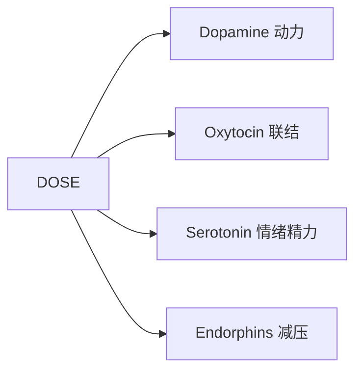
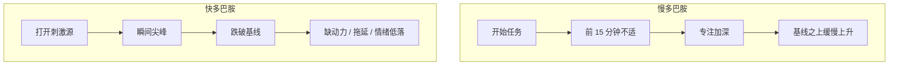

# The DOSE Effect：四种脑化学物质、问卷与挑战

本文是对 TJ Power《The DOSE Effect》的读书笔记整理，用于把书中的脑化学框架、个人计划和挑战清单收成一页。它不是原书替代品。

阅读路径建议：先理解机制 → 填问卷产出个人计划 → 按挑战执行。

## 目录

- [导言与 DOSE 总览](#导言与-dose-总览)
- [四种人体机制](#四种人体机制)
  - [多巴胺](#多巴胺)
  - [催产素](#催产素)
  - [血清素](#血清素)
  - [内啡肽](#内啡肽)
  - [20 项行动速览](#20-项行动速览)
- [调查问卷](#调查问卷)
- [挑战列表](#挑战列表)
  - [多巴胺挑战](#多巴胺挑战)
  - [催产素挑战](#催产素挑战)
  - [血清素挑战](#血清素挑战)
  - [内啡肽挑战](#内啡肽挑战)
  - [DOSE Stacking](#dose-stacking)
  - [全部 Challenge 一览](#全部-challenge-一览)

---

## 导言与 DOSE 总览

DOSE 是四种关键脑化学物质的缩写：

| 字母 | 化学物质 | 核心功能 | 偏低时常见信号 | 提升方向 |
| --- | --- | --- | --- | --- |
| D | Dopamine 多巴胺 | 动力、专注、目标追求 | 拖延、缺动力、情绪低落 | 努力型任务、心流、自律、冷水、清晰追求 |
| O | Oxytocin 催产素 | 联结、自信、爱与归属 | 孤独、自我批判、社交不安 | 贡献、触碰、高质量社交、感恩、成就反馈 |
| S | Serotonin 血清素 | 情绪稳定、日间精力 | 情绪低落、疲惫、脑雾 | 自然、阳光、肠道健康、减少过度思考、深度睡眠 |
| E | Endorphins 内啡肽 | 减压、止痛、身心放松 | 慢性压力、易怒、难放松 | 运动、热疗、音乐、笑声、拉伸 |

原书把每种化学物质拆成 5 项可执行行动（共 20 项），并给出对应 Challenge。下文先讲机制，再给出问卷与挑战；文中交叉链接可在机制、问卷、挑战之间跳转。

---

## 四种人体机制

### 多巴胺

#### 是什么

多巴胺是「通过努力逐渐积累」的激励性化学物质。祖先在狩猎、建造、觅食等艰苦活动中，多巴胺会随接近目标而上升，成功后带来奖励感，从而强化生存相关行为。

关键区分：

- **慢多巴胺**：阅读、整理、深度工作等——开始不立刻爽，坚持几分钟后满足感上升。
- **快多巴胺**：短视频、含糖食物、酒精、色情、赌博、冲动购物等——几乎瞬间尖峰，随后为了体内平衡跌破基线，留下动力不足与拖延。

安德鲁·胡伯曼将成瘾概括为：「逐渐缩小能给你带来快乐的事物范围」。反过来，扩展自然快乐来源，才是可持续的多巴胺策略。

#### 偏低时怎样

六类易耗竭多巴胺的行为：含糖食物、酒精与毒品（含电子烟）、色情、社交媒体、赌博、网上购物。反复尖峰与骤降会「烧坏」系统，表现为长期缺动力与抑郁样症状。

ADHD 相关说明（简要）：基线多巴胺偏低时，快多巴胺刺激更诱人，也更容易分心与冲动；找到真正热爱的活动反而能带来更强的专注峰值。管理重点仍是减少快刺激、增加能抬高基线的健康行为。

#### 提升原则

- 优先做「需要努力、可完成、有明确终点」的任务。
- 抵制成瘾冲动或坚持健康行为时，前扣带回中部皮层（AMCC）被激活；重复训练会增强意志力。
- 进入心流前约 15 分钟最难：多巴胺刚开始爬升，最易分心；撑过这段后动力会自我加强。
- 自然幸福形式包括：深厚社交、身体活动、营养食物、阅读、深度睡眠、整理环境、为目标努力。

#### 五项行动

| 行动 | 一句话 | 挑战 |
| --- | --- | --- |
| 心流状态 | 训练深度专注，用秒表撑过前 15 分钟 | [Flow State / Timer](#timer-challenge计时器挑战) |
| 自律 | 用整洁环境与小习惯建立执行力 | [Discipline Challenge](#discipline-challenge纪律挑战) |
| 手机禁食 | 切断晨晚快多巴胺入口 | [Phone Fasting Challenge](#phone-fasting-challenge手机禁食挑战) |
| 冷水 | 用可控不适换取晨间多巴胺抬升 | [Cold Water Challenge](#cold-water-challenge冷水挑战) |
| 我的追求 | 给多巴胺系统清晰、可追求的未来目标 | [My Pursuit Challenge](#my-pursuit-challenge我的追求挑战) |

健康提示：冷水刺激强度因人而异；有心血管等问题请先咨询医生。

→ [问卷：选多巴胺核心行动](#多巴胺dopamine-选-1) · [回目录](#目录)

### 催产素

#### 是什么

催产素在分娩与早期照护中建立亲密联结，一生中在「给予爱 / 接受爱」时升高。它依赖两件事：

1. **高质量面对面社交**（而非仅线上互动）
2. **积极、感恩的自我对话**（自我批判会损害催产素）

长期社交孤立对健康的负面影响可与每日大量吸烟相比；归属感在进化上本就是生存优势。

#### 偏低时怎样

常见信号：孤独与孤立；缺乏自信与自我信念（内心批评家、外貌焦虑、社交回避）。

四个常见原因：数字化导致交往质量下降；互动时被手机打断；网络攀比抬高期望；对形象的过度自我批判。

公式提醒：**幸福 ≈ 现实 − 期望**。期望长期高于现实，容易陷入失望与嫉妒。

#### 提升原则

- 优先面对面、少手机干扰的联结。
- 既向他人付出，也学会认可自己。
- 用感恩降低「期望通胀」，用成就反馈重塑自我对话。

#### 五项行动

| 行动 | 一句话 | 挑战 |
| --- | --- | --- |
| 贡献 | 每天一次随机善举 | [Contribution Challenge](#contribution-challenge贡献挑战) |
| 触碰 | 拥抱、牵手、依偎或自我护理触感 | [Touch Challenge](#touch-challenge触摸挑战) |
| 社交生活 | 每周安排高质量、无酒精优先的联结 | [Social Life Challenge](#social-life-challenge社交生活挑战) |
| 感恩 | 早晚各问一次「今日感恩」 | [Gratitude Challenge](#gratitude-challenge感恩挑战) |
| 成就 | 早晚各问一次「今日成就」并庆祝他人进步 | [Achievements Challenge](#achievements-challenge成就挑战) |

→ [问卷：选催产素核心行动](#催产素oxytocin-选-1) · [回目录](#目录)

### 血清素

#### 是什么

血清素约有 **90% 在肠道产生**。迷走神经连接肠道与大脑，持续监测心率、呼吸、消化、情绪与精力。「心理健康」并不只发生在颅内——身体状态直接塑造日间体验。

两大功能：**情绪**与**精力**。精力长期偏低时，很难维持平静积极的心境。

#### 偏低时怎样

四个常见原因：

1. 不健康的加工食品饮食（肠道优先「清场」而非合成血清素）
2. 睡眠质量差（晚间屏幕与不规律作息）
3. 缺乏亲近自然的时间
4. 缺乏阳光（尤其是早晨自然光）

高血清素时更常见：心情更稳、内心更平静、日间更有能量。

#### 提升原则

- 身体越健康，大脑越容易「快乐」。
- 自然散步不仅提升情绪，还可通过注意力恢复理论（ART）帮助恢复专注。
- 早晨阳光锚定昼夜节律；饮食以蛋白、蔬果、少超加工为主。
- 用短呼吸练习打断过度思考回路。

#### 五项行动

| 行动 | 一句话 | 挑战 |
| --- | --- | --- |
| 自然 | 不戴耳机、尽量少带手机的户外散步 | [Nature Challenge](#nature-challenge大自然挑战) |
| 阳光 | 醒来后尽早户外接触晨光 | [Sunlight Challenge](#sunlight-challenge阳光挑战) |
| 肠道健康 | 选一项饮食策略坚持执行 | [Gut Health Challenge](#gut-health-challenge肠道健康挑战) |
| 减少过度思考 | 每日 2–5 分钟平静呼吸 | [Underthinking Challenge](#underthinking-challenge停止过度思考挑战) |
| 深度睡眠 | 把睡眠当作本周优先事项 | [Deep Sleep Challenge](#deep-sleep-challenge深度睡眠挑战) |

→ [问卷：选血清素核心行动](#血清素serotonin-选-1) · [回目录](#目录)

### 内啡肽

#### 是什么

内啡肽是身体在剧烈体力挑战或压力情境下释放的天然止痛与减压物质——类似「跑步者愉悦感」。两条原则：

1. 往往需要**真正挑战身体**才会显著释放
2. 它是大脑与身体的主要**减压剂**：感到压力过大时，优先想到如何提升内啡肽

#### 偏低时怎样

信号：经常压力过大；难以摆脱愤怒与沮丧。四个常见原因：缺乏剧烈运动、久坐、缺少欢笑、慢性压力（皮质醇反复过高会削弱内啡肽功能，形成恶性循环）。

高水平时更常见：更乐观、更放松、更能应对日常压力。

#### 提升原则

- 力量 + 耐力的组合训练最直接。
- 热环境、唱歌、大笑、拉伸/瑜伽都能补充释放路径。
- 打破慢性压力循环，需要把减压行为嵌进日常，而不只是「等周末」。

健康提示：热疗（桑拿、蒸汽、长时间热水浴）对有心脏病、高血压等情况可能不适用，请先咨询医生。

#### 五项行动

| 行动 | 一句话 | 挑战 |
| --- | --- | --- |
| 运动 | 每周力量 + 耐力各约 2 次 | [Exercise Challenge](#exercise-challenge运动挑战) |
| 热疗 | 本周进入热环境约 4 次 | [Heat Challenge](#heat-challenge热挑战) |
| 音乐 | 每天早晨唱歌约 5 分钟 | [Music Challenge](#music-challenge音乐挑战) |
| 笑声 | 本周安排 3 次能大笑的环境 | [Laughter Challenge](#laughter-challenge笑声挑战) |
| 拉伸 | 每天短拉伸或瑜伽 | [Stretching Challenge](#stretching-challenge拉伸挑战) |

→ [问卷：选内啡肽核心行动](#内啡肽endorphins-选-1) · [回目录](#目录)

### 20 项行动速览

| # | 化学物质 | 行动 | 问卷 | 挑战 |
| --- | --- | --- | --- | --- |
| 1 | D | 心流状态 | [选核心](#多巴胺dopamine-选-1) | [Timer / Flow](#timer-challenge计时器挑战) |
| 2 | D | 自律 | [选核心](#多巴胺dopamine-选-1) | [Discipline](#discipline-challenge纪律挑战) |
| 3 | D | 手机禁食 | [选核心](#多巴胺dopamine-选-1) | [Phone Fasting](#phone-fasting-challenge手机禁食挑战) |
| 4 | D | 冷水 | [选核心](#多巴胺dopamine-选-1) | [Cold Water](#cold-water-challenge冷水挑战) |
| 5 | D | 我的追求 | [选核心](#多巴胺dopamine-选-1) | [My Pursuit](#my-pursuit-challenge我的追求挑战) |
| 6 | O | 贡献 | [选核心](#催产素oxytocin-选-1) | [Contribution](#contribution-challenge贡献挑战) |
| 7 | O | 触碰 | [选核心](#催产素oxytocin-选-1) | [Touch](#touch-challenge触摸挑战) |
| 8 | O | 社交生活 | [选核心](#催产素oxytocin-选-1) | [Social Life](#social-life-challenge社交生活挑战) |
| 9 | O | 感恩 | [选核心](#催产素oxytocin-选-1) | [Gratitude](#gratitude-challenge感恩挑战) |
| 10 | O | 成就 | [选核心](#催产素oxytocin-选-1) | [Achievements](#achievements-challenge成就挑战) |
| 11 | S | 自然 | [选核心](#血清素serotonin-选-1) | [Nature](#nature-challenge大自然挑战) |
| 12 | S | 阳光 | [选核心](#血清素serotonin-选-1) | [Sunlight](#sunlight-challenge阳光挑战) |
| 13 | S | 肠道健康 | [选核心](#血清素serotonin-选-1) | [Gut Health](#gut-health-challenge肠道健康挑战) |
| 14 | S | 减少过度思考 | [选核心](#血清素serotonin-选-1) | [Underthinking](#underthinking-challenge停止过度思考挑战) |
| 15 | S | 深度睡眠 | [选核心](#血清素serotonin-选-1) | [Deep Sleep](#deep-sleep-challenge深度睡眠挑战) |
| 16 | E | 运动 | [选核心](#内啡肽endorphins-选-1) | [Exercise](#exercise-challenge运动挑战) |
| 17 | E | 热疗 | [选核心](#内啡肽endorphins-选-1) | [Heat](#heat-challenge热挑战) |
| 18 | E | 音乐 | [选核心](#内啡肽endorphins-选-1) | [Music](#music-challenge音乐挑战) |
| 19 | E | 笑声 | [选核心](#内啡肽endorphins-选-1) | [Laughter](#laughter-challenge笑声挑战) |
| 20 | E | 拉伸 | [选核心](#内啡肽endorphins-选-1) | [Stretching](#stretching-challenge拉伸挑战) |

---

## 调查问卷

用途：按 **时间 → 内容 → 周期 → 目标** 填写，产出可执行的个人 DOSE 计划。

填写规则（对齐原书）：

- 每种化学物质先选 **1** 项作为本期核心。
- 四个场景（早晨 / 晚间 / 工作日 / 休息日）中，每个场景对每种化学物质只保留 **1** 项。
- 浏览器勾选**不会自动保存**；需要留档请复制到自己的笔记。

填写说明：勾选 `- [ ]`；填空写在「答：」后。

### 1. 时间问答

#### 1.1 作息基线

- 通常起床时间  
  答：
- 通常入睡时间  
  答：
- 工作日主要工作时段（如 9:00–18:00）  
  答：
- 每周可稳定运动的窗口（星期几 + 时段）  
  答：

#### 1.2 四场景可用时长

| 场景 | 每天/每周大约可投入 | 备注 |
| --- | --- | --- |
| 早晨 Mornings | 答：____ 分钟 |  |
| 晚间 Evenings | 答：____ 分钟 |  |
| 工作日 Work Day | 答：____ 分钟（工作间隙） |  |
| 休息日 Rest Day | 答：____ 分钟 |  |

#### 1.3 各场景优先时段（可多选）

**早晨**

- [ ] 起床后 30 分钟内
- [ ] 早餐前后
- [ ] 出门通勤前
- [ ] 其他：____

**晚间**

- [ ] 下班后到晚饭前
- [ ] 晚饭后
- [ ] 睡前 60 分钟
- [ ] 其他：____

**工作日**

- [ ] 上午深度工作块
- [ ] 午休
- [ ] 下午碎片时间
- [ ] 其他：____

**休息日**

- [ ] 上午
- [ ] 下午
- [ ] 晚上
- [ ] 其他：____

### 2. 内容问答

#### 2.1 主行动（每种化学物质先选 1 个核心）

##### 多巴胺（Dopamine）— 选 1

- [ ] 心流状态（Flow State）
- [ ] 自律（Discipline）
- [ ] 手机禁食（Phone Fasting）
- [ ] 冷水（Cold Water）
- [ ] 我的追求（My Pursuit）

为何选它？  
答：

→ [多巴胺机制](#多巴胺)

##### 催产素（Oxytocin）— 选 1

- [ ] 贡献（Contribution）
- [ ] 触碰（Touch）
- [ ] 社交生活（Social Life）
- [ ] 感恩（Gratitude）
- [ ] 成就（Achievements）

为何选它？  
答：

→ [催产素机制](#催产素)

##### 血清素（Serotonin）— 选 1

- [ ] 自然（Nature）
- [ ] 阳光（Sunlight）
- [ ] 肠道健康（Gut Health）
- [ ] 减少过度思考（Underthinking）
- [ ] 深度睡眠（Deep Sleep）

为何选它？  
答：

→ [血清素机制](#血清素)

##### 内啡肽（Endorphins）— 选 1

- [ ] 运动（Exercise）
- [ ] 热疗（Heat）
- [ ] 音乐（Music）
- [ ] 笑声（Laughter）
- [ ] 拉伸（Stretching）

为何选它？  
答：

→ [内啡肽机制](#内啡肽)

#### 2.2 场景 × 化学物质（每格选 1）

可与 2.1 核心一致，也可按场景微调。下方用汇总表记录最终选择；选项清单见 2.1。

| 场景 | 多巴胺（写 1 项） | 催产素（写 1 项） | 血清素（写 1 项） | 内啡肽（写 1 项） |
| --- | --- | --- | --- | --- |
| 早晨 Mornings | 答： | 答： | 答： | 答： |
| 晚间 Evenings | 答： | 答： | 答： | 答： |
| 工作日 Work Day | 答： | 答： | 答： | 答： |
| 休息日 Rest Day | 答： | 答： | 答： | 答： |

选项速查：

- **D**：心流 / 自律 / 手机禁食 / 冷水 / 我的追求
- **O**：贡献 / 触碰 / 社交生活 / 感恩 / 成就
- **S**：自然 / 阳光 / 肠道健康 / 减少过度思考 / 深度睡眠
- **E**：运动 / 热疗 / 音乐 / 笑声 / 拉伸

#### 2.3 Challenge 细化（只填已选行动）

完整说明见 [挑战列表](#挑战列表)。

**心流状态**

- 本期深度专注的具体任务：答：
- 会告诉谁：答：
- 上午 / 下午各一段是否可行：答：

**自律**

- 先清理的空间（卧室 / 工作区 / 厨房）：答：
- 告诉谁：答：

**手机禁食**

- 早晨不碰手机到何时：答：
- 晚上不碰手机的场景：答：
- 是否采用每天 3 个 Social Media Moments：答：

**冷水**

- 形式（淋浴收尾 / 洗脸 / 其他）：答：
- 是否有人一起：答：

**我的追求**

- 人生首要目标一句话：答：
- 何时去自然中散步思考（不带手机）：答：

**贡献**

- 每日善举方向（家人 / 同事 / 社区）：答：

**触碰**

- 每日拥抱次数（建议约 5）：答：
- 主要对象：答：

**社交生活**

- 本周 3 次高质量社交：答：1. ____　2. ____　3. ____

**感恩 / 成就**

- 早晨提问时机：答：
- 睡前提问时机：答：

**自然 / 阳光**

- 散步地点：答：
- 晨光是否安排在刷手机之前：答：

**肠道健康**

- 本期选 1 个饮食策略：答：

**减少过度思考**

- 呼吸练习时长与时段：答：
- 偏好（共鸣呼吸 / 叹息式呼吸）：答：

**深度睡眠**

- 目标入睡时间：答：
- 睡前科技规则：答：

**运动**

- 力量训练形式与每周次数（建议约 2）：答：
- 耐力训练形式与每周次数（建议约 2）：答：

**热疗 / 音乐 / 笑声 / 拉伸**

- 热疗形式与本周次数（示例约 4）：答：
- 早晨唱歌约 5 分钟是否可行：答：
- 本周 3 次大笑环境：答：
- 拉伸形式（Reach-ups / downs / Twists 或瑜伽）：答：

### 3. 周期问答

#### 3.1 本期启动哪些 Challenge

建议周期来自挑战一览；勾选后填写「我的周期」。

- [ ] [Timer Challenge](#timer-challenge计时器挑战) — 建议：立即开始 — 我的周期：____
- [ ] [Flow State Challenge](#flow-state-challenge心流状态挑战) — 建议：7 天 — 我的周期：____
- [ ] [Discipline Challenge](#discipline-challenge纪律挑战) — 建议：3 天 — 我的周期：____
- [ ] [Phone Fasting Challenge](#phone-fasting-challenge手机禁食挑战) — 建议：7 天 — 我的周期：____
- [ ] [Cold Water Challenge](#cold-water-challenge冷水挑战) — 建议：7 天 — 我的周期：____
- [ ] [My Pursuit Challenge](#my-pursuit-challenge我的追求挑战) — 建议：1 次 — 我的周期：____
- [ ] [Contribution Challenge](#contribution-challenge贡献挑战) — 建议：7 天 — 我的周期：____
- [ ] [Touch Challenge](#touch-challenge触摸挑战) — 建议：7 天 — 我的周期：____
- [ ] [Social Life Challenge](#social-life-challenge社交生活挑战) — 建议：7 天 — 我的周期：____
- [ ] [Gratitude Challenge](#gratitude-challenge感恩挑战) — 建议：7 天 — 我的周期：____
- [ ] [Achievements Challenge](#achievements-challenge成就挑战) — 建议：7 天 — 我的周期：____
- [ ] [Nature Challenge](#nature-challenge大自然挑战) — 建议：7 天 — 我的周期：____
- [ ] [Sunlight Challenge](#sunlight-challenge阳光挑战) — 建议：7 天 — 我的周期：____
- [ ] [Gut Health Challenge](#gut-health-challenge肠道健康挑战) — 建议：7 天+ — 我的周期：____
- [ ] [Underthinking Challenge](#underthinking-challenge停止过度思考挑战) — 建议：7 天 — 我的周期：____
- [ ] [Deep Sleep Challenge](#deep-sleep-challenge深度睡眠挑战) — 建议：7 天 — 我的周期：____
- [ ] [Exercise Challenge](#exercise-challenge运动挑战) — 建议：7 天 — 我的周期：____
- [ ] [Heat Challenge](#heat-challenge热挑战) — 建议：7 天 — 我的周期：____
- [ ] [Music Challenge](#music-challenge音乐挑战) — 建议：7 天 — 我的周期：____
- [ ] [Laughter Challenge](#laughter-challenge笑声挑战) — 建议：7 天 — 我的周期：____
- [ ] [Stretching Challenge](#stretching-challenge拉伸挑战) — 建议：7 天（宜终身） — 我的周期：____
- [ ] [DOSE Stacking Challenge](#dose-stacking) — 建议：每周 1 次 — 我的周期：____

#### 3.2 时间盒与复盘

- 本期开始日：答：
- 本期结束 / 复盘日：答：
- 是否与他人互相监督？对象：答：
- 复盘三问（感觉如何？哪项最有效？下周保留什么？）：答：

#### 3.3 DOSE Stacking（可选）

- [ ] 本期每周安排 1 次叠加活动
- [ ] 社交徒步
- [ ] 晚餐聚会
- [ ] 友谊运动赛
- [ ] 高效工作时段
- [ ] 深度清洁
- [ ] 其他自创：____

计划哪一天做叠加？形式一句话：  
答：

### 4. 目标问答

#### 4.1 当前最想改善的问题（选 1–3）

- [ ] 动力不足 / 拖延（多巴胺）
- [ ] 孤独 / 连接感弱（催产素）
- [ ] 情绪低落 / 精力差（血清素）
- [ ] 压力大 / 难以放松（内啡肽）
- [ ] 其他：____

用自己的话描述现状（2–4 句）：  
答：

#### 4.2 我的追求（My Pursuit）

- 4 周后希望生活有什么可感知的变化？答：
- 成功标准（可观测）：  
  答：1. ____  
  答：2. ____  
  答：3. ____

#### 4.3 责任感（Accountability）

- 会把本计划告知谁？答：
- 告知的一句话版本：答：

### 5. 我的 DOSE 计划汇总

#### 5.1 场景行动总表

| 场景 | 多巴胺 D | 催产素 O | 血清素 S | 内啡肽 E | 优先时段 | 周期备注 |
| --- | --- | --- | --- | --- | --- | --- |
| 早晨 |  |  |  |  |  |  |
| 晚间 |  |  |  |  |  |  |
| 工作日 |  |  |  |  |  |  |
| 休息日 |  |  |  |  |  |  |

#### 5.2 四种化学物质核心行动

| 化学物质 | 本期核心行动 | 为何优先 |
| --- | --- | --- |
| 多巴胺 |  |  |
| 催产素 |  |  |
| 血清素 |  |  |
| 内啡肽 |  |  |

#### 5.3 本期 Challenge 清单

| Challenge 名称 | 开始日 | 结束日 | 完成标准 |
| --- | --- | --- | --- |
|  |  |  |  |
|  |  |  |  |
|  |  |  |  |
|  |  |  |  |
|  |  |  |  |

#### 5.4 一句话计划

答：（例：未来 7 天，早晨阳光 + 手机禁食 + 冷水收尾淋浴；工作日上下午各一段心流；睡前感恩与拉伸；周末一次社交徒步叠加。）

→ [挑战列表](#挑战列表) · [回目录](#目录)

---

## 挑战列表

统一卡片字段：目标 · 做法 · 周期 · 原理（回链机制）· 责任感建议。

### 多巴胺挑战

→ [多巴胺机制](#多巴胺)

#### Timer Challenge（计时器挑战）

- **目标**：训练大脑长时间集中注意力以进入心流
- **做法**：
  1. 选择一项可完成、有挑战性的任务
  2. 告诉某人你将完成它
  3. 手机飞行模式，打开秒表
  4. 开始计时后把手机放到另一个房间（屏幕朝上）
  5. 坚持过前 15 分钟（最难、多巴胺刚爬升）
- **周期**：立即开始，逐步从 15 → 30 → 45 分钟
- **原理**：任务切换可降低约 40% 整体生产力；撑过启动不适后，专注会自我强化
- **责任感**：告知同事或朋友你正在做哪项任务

#### Flow State Challenge（心流状态挑战）

- **目标**：接下来 7 天，每天上午和下午各完成一段深度专注
- **做法**：关键项目、创造性工作、艺术推进、清洁整理，或深度阅读均可
- **周期**：7 天
- **原理**：见 [多巴胺机制](#多巴胺)
- **责任感**：告诉身边的人你将完成此挑战

#### Discipline Challenge（纪律挑战）

- **目标**：3 天内深度清洁卧室、工作空间和厨房
- **做法**：分区清理，完成后观察环境对心境的影响
- **周期**：3 天
- **原理**：整洁环境有助于提升多巴胺并建立自律
- **责任感**：告诉朋友、伴侣或家人

#### Phone Fasting Challenge（手机禁食挑战）

- **目标**：7 天内，每天醒来后与每晚各进行一次手机禁食
- **做法**：
  - 早晨：醒来后不看手机
  - 晚上：社交或家人时光不碰手机
  - 可选：每天只选 3 个 Social Media Moments
- **周期**：7 天
- **原理**：切断快多巴胺尖峰，给系统再生时间；他人拿起手机也会触发预期多巴胺，故尽量全员参与
- **责任感**：邀请朋友或家人互相监督

#### Cold Water Challenge（冷水挑战）

- **目标**：7 天内，每天早上淋浴收尾转为冷水
- **做法**：正常温水洗完后再转冷水
- **周期**：7 天
- **原理**：可控「痛苦」换取多巴胺奖励与韧性（快乐-痛苦平衡）
- **责任感**：尽量找人一起做
- **注意**：有相关健康问题请先咨询医生

#### My Pursuit Challenge（我的追求挑战）

- **目标**：去大自然安静散步（不带手机），想清人生首要目标
- **做法**：散步后与亲近的人讨论你的追求，并邀请对方同样思考
- **周期**：1 次（可定期复盘）
- **原理**：清晰、令人兴奋的未来目标能维持健康的多巴胺基线

### 催产素挑战

→ [催产素机制](#催产素)

#### Contribution Challenge（贡献挑战）

- **目标**：7 天内每天完成一个随机善举
- **做法**：可面向伴侣/家人、朋友、同事、陌生人/社区
- **周期**：7 天
- **原理**：亲社会行为显著提升催产素；帮助他人也会让自己感到温暖平静

#### Touch Challenge（触摸挑战）

- **目标**：每天拥抱约 5 次（一人多次或多人合计）
- **做法**：每次保持几秒；无伴侣者可与家人朋友更长拥抱、安排按摩、与宠物依偎，或日常护肤触感
- **周期**：7 天起，宜长期
- **原理**：身体接触是催产素的高效触发器

#### Social Life Challenge（社交生活挑战）

- **目标**：7 天内计划并经历 3 次高质量社交连接
- **做法**：徒步、健康晚餐、运动比赛、手作等（优先不涉及酒精）；社交焦虑可用：接受 → 眼神接触 → 站姿 → 沉浸对话
- **周期**：7 天
- **原理**：关系质量（非数量）是幸福感的强预测因素

#### Gratitude Challenge（感恩挑战）

- **目标**：7 天内每天早晚各问一次「每日感恩问题」
- **做法**：识别并感激生活中的积极事物，尤其包括对他人的感恩
- **周期**：7 天
- **原理**：性格感恩与更高幸福感及催产素相关；降低「期望高于现实」的落差

#### Achievements Challenge（成就挑战）

- **目标**：7 天内每天早晚各问一次「每日成就问题」
- **做法**：识别并庆祝自己与他人的进步
- **周期**：7 天
- **原理**：持续正面反馈改变自我对话（神经可塑性），进步催生更多进步

### 血清素挑战

→ [血清素机制](#血清素)

#### Nature Challenge（大自然挑战）

- **目标**：一周内完成 3 次不戴耳机的散步
- **做法**：尽量不带手机、不听播客；可结合感恩、成就与「我的追求」思考
- **周期**：7 天
- **原理**：自然暴露改善压力与情绪，并帮助恢复注意力

#### Sunlight Challenge（阳光挑战）

- **目标**：一周内每天醒来后到户外接受早晨阳光
- **做法**：阴天/冬天也坚持（阳台、户外喝咖啡等）；与 Nature Challenge 叠加可一次完成两者
- **周期**：7 天
- **原理**：晨光锚定昼夜节律，帮助启动日间能量系统

#### Gut Health Challenge（肠道健康挑战）

- **目标**：从下列策略中选 **1** 个最有价值的执行（作者常推荐：增蛋白 + 水果当零食）
- **子挑战**：
  1. 放慢进食：充分咀嚼，口间小呼吸
  2. 用水果替代不健康零食
  3. 增加蛋白质摄入，让蛋白成为餐盘主角
  4. 用蔬菜作为主要碳水来源
  5. 80/20 购物车：约 80% 营养食品，20% 零食
  6. 间歇性禁食：第一餐延迟至少两小时（按自身情况评估）
  7. 戒酒两周，观察身心变化
- **周期**：至少 7 天
- **原理**：大部分血清素在肠道产生，饮食直接影响情绪

#### Underthinking Challenge（停止过度思考挑战）

- **目标**：一周内每天早晨完成 2–5 分钟平静呼吸
- **子挑战**：
  1. 共鸣呼吸：安静处练习数分钟
  2. 4-6 呼吸：鼻吸 4 秒，口呼 6 秒
  3. 叹息式呼吸：双吸气后长呼气，约 10 次
- **周期**：7 天
- **原理**：呼气越慢，思绪越易平静；呼吸是可训练技能

#### Deep Sleep Challenge（深度睡眠挑战）

- **目标**：把睡眠作为本周优先事项，实施你选中的关键策略
- **做法可选**：规律作息、减少晚间蓝光、优化睡眠环境、避免晚间咖啡因、睡前平静思绪等
- **周期**：7 天
- **原理**：劣质睡眠会拖垮血清素相关的情绪与精力

### 内啡肽挑战

→ [内啡肽机制](#内啡肽)

#### Exercise Challenge（运动挑战）

- **目标**：一周内完成约 2 次力量训练 + 2 次耐力训练
- **做法**：力量覆盖全身肌群；耐力可选跑/骑/游等；可用竞争与「多走楼梯」增加日常活动量
- **周期**：7 天起
- **原理**：身体被真正推动时内啡肽释放，帮助减压

#### Heat Challenge（热挑战）

- **目标**：7 天内进入热环境约 4 次
- **做法**：热水浴/淋浴、桑拿（优先）、蒸汽房
- **周期**：7 天
- **原理**：热环境中的可控不适触发内啡肽
- **注意**：有心脏病或高血压等请先咨询医生

#### Music Challenge（音乐挑战）

- **目标**：7 天内每天早上唱歌约 5 分钟
- **做法**：可进阶为与他人一起唱歌跳舞
- **周期**：7 天
- **原理**：音乐降低皮质醇、减少焦虑；唱歌跳舞可同时带动催产素与内啡肽

#### Laughter Challenge（笑声挑战）

- **目标**：7 天内让自己处于 3 个能大笑的环境
- **做法**：社交玩笑、喜剧、有趣的游戏等
- **周期**：7 天
- **原理**：笑是强内啡肽释放器；与人共笑还可提升催产素

#### Stretching Challenge（拉伸挑战）

- **目标**：7 天内每天完成拉伸或瑜伽（宜终身）
- **做法**：Reach-ups、Reach-downs、Twists，或短瑜伽流程；可选横杆悬挂
- **周期**：7 天起，长期坚持
- **原理**：拉伸/瑜伽提升内啡肽并降低皮质醇，改善睡眠与情绪调节

### DOSE Stacking

#### DOSE Stacking Challenge（DOSE 叠加挑战）

- **目标**：设计一个每周一次的活动，同时激活多种脑化学物质
- **示例**：
  1. **社交徒步**：手机禁食 + 社交 + 自然 + 阳光 + 肠道相关饮食注意 + 运动 + 音乐
  2. **晚餐聚会**：手机禁食 + 社交 + 感恩 + 成就 + 肠道健康 + 笑声
  3. **友谊运动赛**：心流 + 运动 + 贡献 + 触碰 + 社交 + 自然 + 阳光 + 音乐
  4. **高效工作时段**：心流 + 自律 + 手机禁食 + 追求 + 成就 + 阳光 + 运动/音乐间歇
  5. **深度清洁**：自律 + 手机禁食 + 追求清晰 + 贡献（帮家人整理）+ 成就 + 音乐
- **周期**：每周 1 次
- **原理**：一次活动叠加多种释放路径，提高坚持效率

→ [问卷：选择叠加活动](#33-dose-stacking可选) · [回目录](#目录)

### 全部 Challenge 一览

| # | 章节 | Challenge | 核心任务 | 周期 |
| --- | --- | --- | --- | --- |
| 1 | Ch1 | Timer | 秒表训练 15 分钟+ 深度专注 | 立即开始 |
| 2 | Ch1 | Flow State | 每天上下午各 1 段深度专注 | 7 天 |
| 3 | Ch2 | Discipline | 深度清洁卧室/工作区/厨房 | 3 天 |
| 4 | Ch3 | Phone Fasting | 醒来 + 每晚不看手机 | 7 天 |
| 5 | Ch4 | Cold Water | 每天早上冷水淋浴收尾 | 7 天 |
| 6 | Ch5 | My Pursuit | 安静散步思考人生首要目标 | 1 次 |
| 7 | Ch6 | Contribution | 每天 1 个随机善举 | 7 天 |
| 8 | Ch7 | Touch | 每天约 5 次拥抱 | 7 天 |
| 9 | Ch8 | Social Life | 3 次高质量社交 | 7 天 |
| 10 | Ch9 | Gratitude | 每天早晚感恩问题 | 7 天 |
| 11 | Ch10 | Achievements | 每天早晚成就问题 | 7 天 |
| 12 | Ch11 | Nature | 3 次不戴耳机散步 | 7 天 |
| 13 | Ch12 | Sunlight | 每天早晨户外阳光 | 7 天 |
| 14 | Ch13 | Gut Health + 7 子挑战 | 选 1 个饮食策略 | 7 天+ |
| 15 | Ch14 | Underthinking + 3 子挑战 | 每天 2–5 分钟呼吸 | 7 天 |
| 16 | Ch15 | Deep Sleep | 优先睡眠并执行关键策略 | 7 天 |
| 17 | Ch16 | Exercise | 2 次力量 + 2 次耐力 | 7 天 |
| 18 | Ch17 | Heat | 4 次热环境 | 7 天 |
| 19 | Ch18 | Music | 每天早晨唱歌 5 分钟 | 7 天 |
| 20 | Ch19 | Laughter | 3 次大笑环境 | 7 天 |
| 21 | Ch20 | Stretching | 每天拉伸 | 7 天（宜终身） |
| 22 | 附录 | DOSE Stacking | 设计叠加活动 | 每周 1 次 |

---

参考：TJ Power,《The DOSE Effect》。本文为个人读书笔记结构重梳，便于实践，不替代原书与专业医疗建议。

[回目录](#目录) · [回问卷汇总](#5-我的-dose-计划汇总) · [回机制总览](#导言与-dose-总览)
